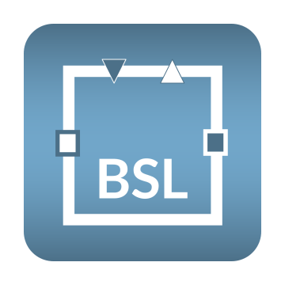
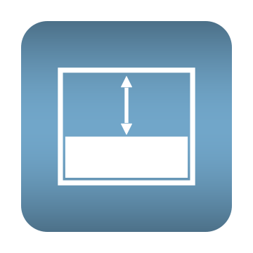

# Business Simulation Library (BSL)
A Modelica library for modeling and simulation of dynamical systems in the social sciences, such as business, economics, and ecology, using the system dynamics approach. The term "Business Simulation" is used in a broad sense, as modeling in these domains is concerned with control, decision making, and management of resources.

## Library Description
The __BSL__ adopts the widely recognized __System Dynamics__ approach and modeling paradigm introduced by Jay W. Forrester. System dynamics provides a versatile, foundational modeling framework, ideally suited for modeling, simulating, and analyzing strategic business or public policy issues. 

Unlike existing aproaches, the __BSL__ utilizes Modelica's acausal connectors to accurately model the flow of _conserved quantities_ such as matter, energy, or information, as well as to represent instantaneous _information signal flows_ through causal connections. Using pre-built components and hierarchical modeling, even complex models can be developed in a fast and reliable manner with the added benefits of embedded documentation and compact presentation.

#### Overview of the Main Packages

| Icon     | Name              | Description |
| :-------:|:------------------|:------------|
|  |  __CausalLoop__ | Agile system dynamics modeling with quantitative causal loop diagrams (CLD+) |
|  | __Stocks__  | Containers ("reservoirs") used to represent entities that have been stored in a specific state |
|  | __Flows__ | Processes that move entities from one stock to another at a specific rate |
|  | __SourcesOrSinks__ | Flows into or out of a stock with infinite capacity at a system's boundary |
|  | __Converters__ | Information processing (blocks) |
|  | __InformationSources__ | External information input |
|  | __MoleculesOfStructure__ | Pre-built components to model _information processing_, _decision making_, and _subsystems_ in general |

## Documentation and Release Notes
You can read the documentation for the library online at: 
[https://bsl-support.de/BusinessSimulation/BusinessSimulation](https://bsl-support.de/BusinessSimulation/BusinessSimulation.html)

[Release Notes](https://bsl-support.de/BusinessSimulation/BusinessSimulation.UsersGuide.ReleaseNotes.html) are included with the documentation and can be found there as well.

The library was developed and tested using Wolfram System Modeler and Wolfram Mathematica. User experience may differ when using other modeling and simulation environments.

The freely available Lato fonts family is used by library classes; for the best visual experience it is highly recommended to install this font on your computer, which is available for download from its [official site](https://www.latofonts.com/lato-free-fonts/) or&mdash;in an earlier version&mdash;from the [Google Fonts](https://fonts.google.com/specimen/Lato?query=Lato) website.

## Publications
- Reichert, GW. 2022. Hierarchical, Component-Based Modeling Using the Cyber-Physical Modeling Language Modelica. In <em>Conference Record of the 2022 System Dynamics Conference</em>. Frankfurt, Germany, System Dynamics Society. [&nbsp;<a href="https://proceedings.systemdynamics.org/2022/papers/P1332.pdf">online</a>&nbsp;]

- Reichert, GW. 2022. Business Simulation Library v2.0 released. _System Dynamics Review_
**38**(1): 113–116. [&nbsp;<a href="https://doi.org/10.1002/sdr.1703">DOI</a>&nbsp;]

## License
Copyright © 2020 Guido Wolf Reichert  
Licensed under the **European Union Public Licence (EUPL), Version 1.2 or later** (the "License")

You may not use this work except in compliance with the License. You may obtain a copy of the License at: 
[https://eur-lex.europa.eu/eli/dec_impl/2017/863/oj](https://eur-lex.europa.eu/eli/dec_impl/2017/863/oj)

Unless required by applicable law or agreed to in writing, software distributed under the License is distributed on an "AS IS" basis, WITHOUT WARRANTIES OR CONDITIONS OF ANY KIND, either expressed or implied. See the License for the specific language governing permissions and limitations under the License.

__Modelica©__ is a registered trademark of the Modelica Association. 
__Wolfram System Modeler&trade;__ is a trademark of Wolfram Research, Inc. 
__Wolfram Mathematica and Mathematica&trade;__ are registered trademarks of Wolfram Research, Inc.

## Development and Contribution
You may report bugs and other issues or simply make suggestions for future enhancements by using the Issues button.

Please refrain from pull requests until an appropriate Contributor License Agreement (CLA) has been established.

## Corresponding Author

